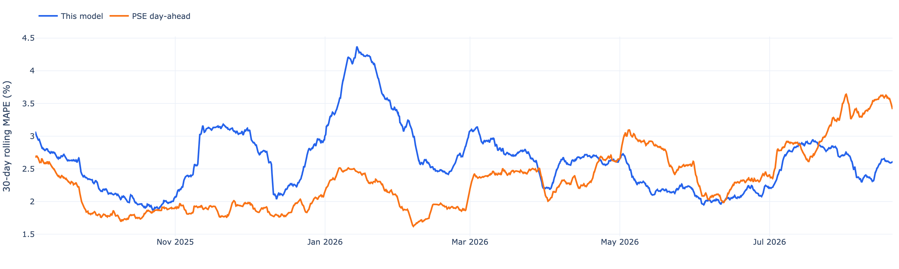
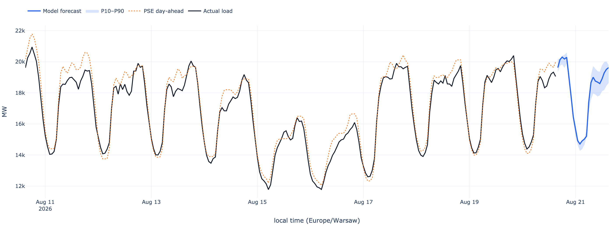

# Day-Ahead Electricity Load Forecasting — Polish Bidding Zone

Hourly forecasts of how much electricity Poland will use tomorrow, benchmarked against
the grid operator's own published forecast.

Poland's transmission system operator, **PSE**, has to decide a day in advance how much
generation to schedule. Too little and the system buys expensive balancing energy at
short notice; too much and plants are paid to stand ready for demand that never arrives.
The whole day-ahead market clears on that number. PSE publishes its own forecast to the
ENTSO-E Transparency Platform, which means anyone building a demand model has something
most forecasting projects lack: **a real operational benchmark, not a strawman.** Every
result below is reported against it.

The point of this repository is the loop rather than the model. Ingestion → a versioned
dataset → leakage-safe features → tracked training → a gated promotion → serving →
drift monitoring → automated retraining, running daily on free infrastructure. LightGBM
on engineered features is the easy part.

**Result, honestly:** over the most recent year the model does **not** beat PSE. Scored
at PSE's own lead time and on the weather that was actually forecast a day ahead, it
reaches **2.64% MAPE against PSE's 2.35%** across 8,736 out-of-sample hours — 12% *more*
error, not less. It beats PSE in spring and summer and loses in autumn, winter and on
holidays.

An earlier version of this README claimed a 0.71 pp win. That number came from the oldest
year in the data, a horizon that did not match PSE's, and weather nobody had at forecast
time. [The audit that found it](docs/evaluation_notes.md) is the most useful document
here.

---

## Architecture

```mermaid
flowchart LR
    subgraph sources["Sources — free"]
        direction TB
        entsoe["<b>ENTSO-E</b><br/>actual load<br/><b>+ PSE forecast</b>"]
        meteo["<b>Open-Meteo</b><br/>weather, 7 cities<br/>archive + forecast"]
    end

    dataset[("dataset.parquet<br/>UTC-hourly<br/>content-fingerprinted")]
    features["<b>make_features(df, H)</b><br/>one builder — training<br/><i>and</i> serving<br/>every load lag ≥ H"]
    gate{"<b>promotion gate</b><br/>beats naive?<br/>no regression<br/>vs champion?"}
    registry[("<b>MLflow registry</b><br/>@champion")]
    predlog[("<b>prediction log</b><br/>every served hour<br/>+ its features")]
    state[("orphan branch<br/><b>pipeline-state</b><br/>ADR-008")]

    subgraph loop["GitHub Actions — daily, 05:30 UTC"]
        direction TB
        ingest["<b>ingest</b><br/>trailing re-pull<br/>pandera checks"]
        evaluate["<b>evaluate</b><br/>score served hours<br/>as actuals arrive"]
        drift["<b>check_drift</b><br/>Evidently, seasonal<br/>reference · sets flag"]
        retrain["<b>retrain_if_needed</b><br/>cadence or flag"]
        fc["<b>forecast</b><br/>day-ahead from<br/>the champion"]
        ingest --> evaluate --> drift --> retrain --> fc
    end

    subgraph serving["Serving"]
        direction TB
        api["<b>FastAPI</b><br/>/forecast · /health<br/>/reload-model"]
        dash["<b>Streamlit</b><br/>forecast · benchmark<br/>drift · model card"]
    end

    sources --> ingest
    ingest --> dataset --> features
    dataset --> drift
    features --> retrain --> gate
    gate -->|"passes"| registry
    gate -->|"fails — production untouched"| registry
    registry --> fc
    features --> fc --> predlog --> evaluate
    registry --> api --> predlog

    state -.->|"restore"| ingest
    fc -.->|"snapshot"| state
    state -.->|"hourly mirror"| dash

    style gate fill:#fef3c7,stroke:#d97706,stroke-width:2px
    style entsoe fill:#dbeafe,stroke:#2563eb
    style features fill:#dcfce7,stroke:#16a34a
    style predlog fill:#f3e8ff,stroke:#9333ea
```



Everything runs on free tiers. The scheduled loop is GitHub Actions; the registry and
the prediction log are carried between ephemeral runners on an orphan branch
([ADR-008](docs/ADR.md)); the dashboard is a container that mirrors that branch.

---

## Benchmark results

**8,736 matched out-of-sample hours, 2025-08-21 → 2026-08-19**, 13 expanding-window
origins, a 24-hour embargo between each training block and the block it predicts, and
every model scored on identical timestamps. Produced by `uv run python -m pipelines.audit`
and written to [`reports/audit_h24.md`](reports/audit_h24.md).

Three variants, each removing one advantage the previously reported figure enjoyed:

| Variant | Model MAPE | PSE MAPE | Gap | Model RMSE | PSE RMSE |
|---|---|---|---|---|---|
| **A.** flat 24 h horizon, observed weather | 2.364% | 2.351% | +0.013 pp | 603 MW | 566 MW |
| **B.** gate-closure horizons, observed weather | 2.576% | 2.351% | +0.225 pp | 640 MW | 566 MW |
| **C.** gate-closure horizons, day-ahead forecast weather | **2.642%** | **2.351%** | **+0.291 pp** | 670 MW | 566 MW |

Naive seasonal (`load[T−168]`) over the same hours: **5.763%**. Both forecasts beat it by
a wide margin; that was never the interesting question.

**C is the reportable number.** A is the methodology this README used to publish, and the
distance between them is what the audit was for: making the horizon like-for-like costs
0.212 pp, using forecast rather than observed weather costs a further 0.066 pp, and
together that is more than the entire margin A appeared to show.

### Evaluation conditions

Stated explicitly, because a benchmark number without them is not checkable:

| | |
|---|---|
| **Period** | 2025-08-21 → 2026-08-19 (364 days, the most recent full year) |
| **Hours scored** | 8,736, identical for the model, PSE and the naive baseline |
| **Horizon** | per hour, matched to PSE's publication deadline: 14 h for 00:00 local, rising to 37 h for 23:00 |
| **Weather** | what Open-Meteo forecast one day ahead — not what was later observed |
| **Splits** | 13 expanding-window origins, 28-day test blocks, 24-hour embargo ([ADR-006](docs/ADR.md)) |
| **Tuning** | none; LightGBM defaults. Worth ~0.036 pp on the 2021 backtest, so a tuned model would still lose |



The seasonal structure is the result, and it is invisible in the annual average. The
model (blue) runs well above PSE through the autumn and winter — peaking at 4.4% against
PSE's 2.5% in the January cold — trades places through spring, and is clearly better
through July and August, where PSE degrades to 3.5% and the model holds near 2.6%.

### Where it wins and where it loses

| Segment | Hours | Model | PSE | Gap | |
|---|---|---|---|---|---|
| Christmas–New Year | 216 | 4.216% | 3.036% | +1.180 pp | PSE |
| Winter | 2160 | 3.132% | 2.121% | +1.010 pp | PSE |
| Holidays | 336 | 4.134% | 3.513% | +0.621 pp | PSE |
| Autumn | 2185 | 2.446% | 1.888% | +0.558 pp | PSE |
| Weekdays | 6240 | 2.635% | 2.270% | +0.366 pp | PSE |
| Off-peak hours | 3276 | 2.383% | 2.032% | +0.350 pp | PSE |
| Peak hours | 5460 | 2.797% | 2.542% | +0.255 pp | PSE |
| Weekends | 2496 | 2.657% | 2.555% | +0.102 pp | PSE |
| **Spring** | 2207 | 2.336% | 2.473% | **−0.137 pp** | **model** |
| **Summer** | 2184 | 2.662% | 2.918% | **−0.256 pp** | **model** |

The seasonal split is the story. Mild weather is where a temperature-driven gradient
booster does well; winter — heating demand, daylight, and holidays interacting — is where
PSE's operational knowledge shows. Christmas–New Year is the worst segment in the
repository and has been in every evaluation run against it.

### The most interesting thing the audit found

Not the aggregate. **This model degrades with lead time and PSE does not.**

| Local hour | Lead | Model | PSE | Gap |
|---|---|---|---|---|
| 09:00 | 23 h | 2.887% | 2.960% | **−0.073 pp** |
| 11:00 | 25 h | 3.171% | 3.220% | **−0.050 pp** |
| 19:00 | 33 h | 2.518% | 1.916% | +0.602 pp |
| 23:00 | 37 h | 2.828% | 2.006% | **+0.821 pp** |

The correlation between the gap and the lead time is **+0.65**. The model is level with
PSE at 23–25 hours — the only place it wins — and loses by 0.82 pp at 37 hours. It leans
on recent load (`load_lag_168` and `load_lag_24` dominate its feature importance), and at
a 37-hour horizon the useful lags are gone. PSE evidently has structural information —
planned outages, industrial schedules, its own load research — that does not decay with
lead time.

PSE's own error, meanwhile, tracks the *hour* rather than the lead: worst at midday
(3.2%), best in the late evening (1.9%) despite that being the longest lead it faces.

The older flat-horizon backtest over 2021 is kept at
[`reports/benchmark_h24.md`](reports/benchmark_h24.md) as a labelled historical
measurement. It reports 1.947% against PSE's 2.658%; roughly half of that difference is
that PSE's forecast has since improved, and the rest is the two corrections above.

---

## The engineering worth reading

Six decisions that shaped the result. Each is recorded in full, with the alternatives
and what would change our mind, in [`docs/ADR.md`](docs/ADR.md).

### The leakage rule

Forecasting `load[T]` from the standpoint of `T − H`, **every load-derived feature must
be at least `H` hours old relative to the target.** A lag shorter than the horizon is a
bug, not a tuning choice: the backtest looks spectacular and production is worthless,
with no visible failure in between.

Rows are indexed by **target hour**, not by prediction moment
([ADR-005](docs/ADR.md)) — so the minimum lag is exactly `H`, not approximately. The
first implementation followed the more obvious convention and quietly cost a factor of
two: `load[t − H]` at row `t` is `load[T − 2H]` relative to the target, which throws
away the freshest day of genuinely-available history for no safety gain.

The guarantee is checked three ways at four horizons, in
[`tests/test_no_leakage.py`](tests/test_no_leakage.py): **structurally** (read the
generated columns, assert every offset), **behaviourally** (replace the future of the
load series with an absurd sentinel and assert nothing on the past side moves), and
**arithmetically** (recompute the rolling window and the target by hand). The
behavioural test is the one that matters — it catches leakage the column names would
never reveal.

### One feature builder, used by training and by serving

[`make_features`](src/features/builder.py) is called by the training pipeline, the
backtest, the API and the scheduled forecast step. There is no second copy in the
serving layer, because divergence between two implementations of the same transform is
a silent and expensive bug class. The serving side
([`src/features/inference.py`](src/features/inference.py)) contains no feature logic at
all — it splices recorded history to forecast weather and hands the result to the same
function.

### Train–serve weather skew, measured rather than mentioned

Training sees *observed* weather. Serving only ever sees *forecast* weather, which is
worse. Train on the first and serve on the second and live accuracy quietly falls below
the backtest, with nothing in the logs to say why.

This repository used to state that honestly and leave it unquantified. It is now
measured: the audit re-runs the whole backtest with the weather features replaced by
**what Open-Meteo actually forecast a day ahead** of each hour, from its archive of past
forecast runs.

**The skew is worth 0.066 pp of MAPE** (2.576% → 2.642%). For scale, weather features are
worth about 0.175 pp in total, so serving on forecast weather gives back roughly 38% of
everything the weather buys. The old README bounded the penalty inside that 0.175 pp gap
and said it could not be larger; the bound held, and the measured value sits in the upper
half of it.

Two caveats on the measurement. Only **temperature** is swapped — Open-Meteo's forecast
archive carries wind and cloud only from 2024-01, and swapping those too would have left
the audited variant with a fraction of the training history the others had, turning a
weather measurement into a training-size one. And the archive's day-ahead vintage is not
identical to the exact run PSE's forecasters saw. It is a lower bound, and it is stated
as one.

### Seasonality is not drift

Input drift fires on most nights, and that is the correct behaviour rather than a fault.
The current window is a fortnight of one realised season judged against a three-year
season-matched reference — a narrow distribution against a wide one — so a normed
Wasserstein distance above the threshold is close to guaranteed
([ADR-009](docs/ADR.md)).

The response is not to tune the threshold until the alarms stop, because a threshold high
enough to ignore an October temperature swing is also high enough to ignore a real
October regime change. Instead: input drift is treated as an **early warning that
triggers a retrain attempt**, and the promotion gate is what actually protects
production. The dashboard shows the drifted share as a trend rather than a red light,
because a permanently red light gets muted, and a muted alert is not a control.

That ADR also carries a correction worth reading: the original version rested on a
sentence that was false. Evidently returns a p-value on small samples and a distance on
large ones, picking by sample size rather than being told, and the parser read every
value as a p-value — so on every real comparison it reported the *complement* of the
drifted columns. The finding, the cause, and what it invalidated are recorded rather
than quietly patched.

### The gate holding a candidate back

The clearest evidence the system works is a night it declined to do anything. A
scheduled retrain on 2026-08-20 produced a candidate at **2.31% MAPE** against a
champion holding **2.11%** on the same metric. It was logged to MLflow with its params,
metrics and dataset fingerprint — and left there. The `@champion` alias did not move.

```
Retrain: TRAINED_NOT_PROMOTED — drift flag raised
  gate: candidate 2.308 regresses past the champion's 2.115
```

Unattended retraining that can silently make production worse is worse than no
unattended retraining. This is also a limitation, not only a triumph — see below.

### State that survives an ephemeral runner

GitHub's runners are destroyed when the job ends, and one piece of state cannot be
recreated: **the prediction log.** What the model said about tomorrow can only be
recorded before tomorrow happens. `actions/cache` is evicted after seven days with no
durability guarantee; workflow artifacts expire and cannot be updated in place; an object
store needs an account and a bill. So the loop force-pushes a single snapshot of
`state/`, `mlruns/` and `data/processed/` to an orphan branch, and restores it at the
start of the next run ([ADR-008](docs/ADR.md)). The hosted dashboard reads that same
branch.

---

## Data inventory

| Data | Source | Resolution | Range | Notes |
|---|---|---|---|---|
| Actual total load (PL) | ENTSO-E Transparency Platform | native 15-min or 60-min → resampled hourly (mean) | 2019-01-01 → now | the target |
| Day-ahead load forecast (PL) | ENTSO-E Transparency Platform | hourly | same | **the benchmark** (PSE's own) |
| Historical weather | Open-Meteo Archive API | hourly | same, lags real time ~5 days | 7 cities, population-weighted |
| Forecast weather | Open-Meteo Forecast API | hourly | the days the archive has not reached, plus the future | used at serving time |
| Day-ahead forecast weather | Open-Meteo Historical Forecast API | hourly | 2021-03 → now (temperature); 2024-01 → now (wind, cloud) | **evaluation only** — measures the train–serve skew |
| Public holidays | `holidays` (PL), offline | daily | — | evaluated on the **Europe/Warsaw** calendar date |

Everything is stored and computed on a **UTC** hourly index. `Europe/Warsaw` is used only
where the local calendar is semantically required (holiday flags, the hour-of-day
features people actually behave on) and for display. Both DST transitions are covered by
tests: Warsaw loses an hour each spring and repeats one each autumn, and naive resampling
across those boundaries produces NaNs or duplicate-index errors.

### Getting an ENTSO-E token

It has a lead time, so do it first.

1. Register at <https://transparency.entsoe.eu/>.
2. Email `transparency@entsoe.eu` with **"Restful API access"** in the subject and your
   registered email address in the body.
3. Access is granted within about three working days. The token then appears in your
   account under *Web API Security Token*.

Put it in `.env` as `ENTSOE_API_KEY` (see [`.env.example`](.env.example)). It is a
secret and is never committed. Open-Meteo needs no key at all.

Without a token, training and the backtest fall back to the synthetic generator in
[`src/synthetic.py`](src/synthetic.py) so the loop still runs end to end. Those runs are
named `*_synthetic`, tagged `data_source=synthetic` in MLflow, carry a banner on every
report, and light up a full-width warning on the dashboard. A metric from invented data
measures the plumbing and nothing else.

---

## Setup

```bash
git clone https://github.com/tomeelow/load-forecasting.git && cd load-forecasting
```

```bash
uv sync && cp .env.example .env
```

```bash
uv run pytest
```

The test suite needs **no network and no token** — that is enforced by
[`tests/conftest.py`](tests/conftest.py), which blocks HTTP at the transport and points
the `.env` loader at a file that does not exist, rather than trusting the constraint.

Those three commands were run against a fresh `git clone` of this repository on
2026-08-21: **450 tests passed in 77 seconds**, with no token in the environment. The
same three run in CI on every pull request
([`.github/workflows/ci.yml`](.github/workflows/ci.yml)).

On macOS, LightGBM needs the OpenMP runtime, which is not a Python package:
`brew install libomp`.

Paste your ENTSO-E token into `.env`, then pull the history and serve:

```bash
uv run python -m pipelines.ingest --full
```

```bash
uv run streamlit run src/dashboard/app.py
```

### The full stack

```bash
docker compose up
```

Brings up MLflow on Postgres (`:5000`), the forecast API (`:8000`) and the dashboard
(`:8501`). The registry starts empty, so the API answers `/health` with 503 and the
dashboard names the model it cannot find — that is the correct first-run state. Populate
it with a training run through the same image:

```bash
docker compose run --rm trainer python -m pipelines.train
```

> **The image builds; the stack has not been run.** CI validates the Compose file and
> builds the API image from a clean checkout on every push
> ([`.github/workflows/ci.yml`](.github/workflows/ci.yml)) — that is what caught the
> missing `COPY README.md` the build backend needed. `tests/test_compose.py` additionally
> checks the wiring as data: services, shared volumes, published ports, the OpenMP
> runtime LightGBM needs, and that the code honours `MLFLOW_TRACKING_URI`.
>
> What has *not* happened is `docker compose up` — no container has been started, so the
> four services have never been seen talking to each other. Treat the one-command stack
> as unproven until someone runs it.

### Everything else

```bash
uv run python -m pipelines.train          # baselines + LightGBM variants + the gate
uv run python -m pipelines.backtest       # the rolling-origin benchmark table
uv run python -m pipelines.audit          # the fairness audit (hours of compute)
uv run uvicorn src.api.main:app --port 8000
uv run mlflow ui --backend-store-uri sqlite:///mlruns/mlflow.db
```

The five pipelines of the scheduled loop, each runnable alone for debugging:

```bash
uv run python -m pipelines.ingest
uv run python -m pipelines.evaluate
uv run python -m pipelines.check_drift
uv run python -m pipelines.retrain_if_needed
uv run python -m pipelines.forecast
```

They run in that order daily via
[`.github/workflows/daily-loop.yml`](.github/workflows/daily-loop.yml). Trigger one by
hand with:

```bash
gh workflow run daily-loop.yml -f force_retrain=false
```

**Scheduled retraining runs on GitHub Actions regardless of where anything is hosted.**
The live loop does not depend on the API or the dashboard being up anywhere — that is
what the state branch buys, and it is why the whole system costs nothing to run.

### Deploying the dashboard

[`deploy/space/README-deploy.md`](deploy/space/README-deploy.md) has the Hugging Face
Spaces route (Docker SDK, free tier, no payment method). The deployed page mirrors the
`pipeline-state` branch hourly and says on the page that it is a mirror rather than a
live service, because it cannot reach an API or fetch fresh weather. Render, Railway and
Fly.io work the same way with the same two environment variables; free instances on all
of them sleep when idle.

> **TODO — deployed URL.** No Space exists yet: creating one needs a Hugging Face
> account and a token, which is a step for the repository owner rather than something
> this repository automates. Follow `deploy/space/README-deploy.md` and paste the link
> here.

---

## Screenshot



Ten days of realised demand in black, PSE's published day-ahead forecast dotted, and the
model's own forecast in blue with its P10–P90 band. Regenerate it from whatever the
pipelines currently hold with `uv run python -m src.dashboard.figures` — it is drawn by
the same function that draws the dashboard, so the image cannot drift away from the page.

---

## Known limitations

Every real system has rough edges. These are this one's.

**The model does not beat the benchmark it was built to beat.** Over a recent year, at
PSE's own lead time and on forecast weather, it is 0.29 pp behind. It wins in spring and
summer and loses in autumn, winter and on holidays. That is a real result — a LightGBM
model on free public data landing within 0.3 pp of a national TSO's operational forecast
is not nothing — but it is not the result this README used to claim, and the difference
was two evaluation choices rather than any change to the model.

**Input drift fires on most nights, so the loop attempts a retrain most nights.** The
cause is the shape of the comparison rather than the season — a fortnight against a
three-year reference is narrow against wide — and a seasonal reference window cannot fix
it, because it makes the reference *wider*. The promotion gate is the real safeguard;
input drift is closer to a scheduler than to an alarm. The honest fix is a like-sized
reference sample, a threshold chosen against a measured false-alarm rate, or demoting
the input-drift trigger to report-only. That is an operational judgement with evidence
still to gather, and it is recorded in [ADR-009](docs/ADR.md) rather than quietly
patched.

**The gate compares MAPE across different 60-day windows.** A candidate trained today is
scored on the last 60 days; the champion's number came from the 60 days before *it* was
promoted. A rough-weather month therefore looks like model regression, and the gate will
refuse a candidate that is genuinely better on like-for-like data. The 2.31% vs 2.11%
rejection above may well be an instance of exactly this. Fixing it means scoring both
models on the same held-out block at gate time, which is a real change to
[`src/models/promotion.py`](src/models/promotion.py) and is the first thing worth doing
next.

**Served-prediction monitoring is still accumulating.** The `forecast` step that fills
the prediction log is new, so production error is measured over days rather than months.
The dashboard says so — a panel reading "accumulating, N of 168" instead of a number —
and it needs about a week of scheduled runs before the rolling MAPE means anything. The
backtest is a year of out-of-sample hours and is a different claim; the two are never
merged.

**The one-time history rebuild is slow and all-or-nothing.** `pipelines.ingest --full`
pulls seven years from two APIs. Measured on the CI run that built the current dataset
(2026-08-20): **18m 15s** for the ingest step, against **15 seconds** for the incremental
run the next morning. A failure part-way leaves nothing and starts over. Chunking the
archive pull by year made timeouts survivable but did not make the rebuild resumable.

**The loop has only recently started succeeding.** Every scheduled run from 2026-08-14
to 2026-08-20 failed — a missing `setup-uv` tag, ENTSO-E read timeouts `entsoe-py` does
not retry, an unchunked weather pull that timed out, and a first run with no state to
bootstrap from. Each fix is a commit in the history. As of 2026-08-21 there have been two
successful runs: one manual (21m 41s, including the full rebuild) and one scheduled
(4m 16s). A week of green runs is what would make "operational" a fair word, and it has
not happened yet.

**The backtest tunes once and freezes.** Hyperparameters are searched on the first
origin's training block and reused at every later one ([ADR-007](docs/ADR.md)). It leaks
nothing, but a genuine regime change late in the window is handled with stale settings —
which, if anything, understates the model.

**One bidding zone, one horizon.** `model.horizons` is a list and the code is
horizon-parametrised throughout, but only `[24]` has ever been trained and served.

---

## What I'd do with more time

**Train for the horizon the product actually needs.** The audit's most useful finding is
that this model degrades with lead time and PSE's does not — level at 23 hours, 0.82 pp
behind at 37. The served model is trained once at 24 hours and then asked to stretch
across a delivery day whose lead times run from 14 to 37. A direct model per horizon,
with a feature set chosen for that horizon rather than inherited from H=24, is the change
most likely to close the gap, and the gate-closure evaluation already exists to measure
whether it did.

**Fix the holiday and Christmas–New Year regime.** The worst segment in the repository:
4.22% against PSE's 3.04% across 216 hours, and winter as a whole is 1.01 pp behind. A
holiday flag is not enough — that week behaves like neither a weekday nor a weekend nor a
normal holiday, and there are only a handful of them in the training data. "Days from
nearest holiday", explicit bridge-day handling, and separating heating-degree-days from
raw temperature are the obvious first attempts, and winter is where the annual average is
being lost.

**Score the gate on a shared block.** The safeguard that protects production compares two
MAPEs measured on different 60-day windows, so a rough-weather month reads as model
regression. Holding out one common evaluation block and scoring both champion and
candidate on it would make the gate mean what it claims to.

---

## Repository layout

```
src/ingestion/   ENTSO-E + Open-Meteo clients, dataset assembly, validation
src/features/    leakage-safe feature builder (shared by training and serving)
src/models/      baselines, LightGBM, tuning, promotion gate, MLflow tracking
src/evaluation/  metrics, chronological splits, rolling-origin + gate-closure backtests
src/api/         FastAPI service: /forecast, /health, /reload-model
src/monitoring/  Evidently drift, the seasonal reference window, the drift history
src/dashboard/   Streamlit app, its data layer, and the hosted-mirror state sync
src/             prediction log, pipeline state, holiday calendar, synthetic generator
pipelines/       ingest, train, backtest, audit + the loop: evaluate, check_drift,
                 retrain_if_needed, forecast
config/          pipeline parameters (dates, cities, horizon, thresholds, bounds)
tests/           leakage, DST, timezone, validation, retry, gate, loop, dashboard
docs/            plan, ADR, evaluation audit, blog post, demo script
docker/          the image both services are built from
deploy/space/    Hugging Face Spaces deployment
reports/         generated benchmark tables (the .md files are versioned)
monitoring/      generated drift reports (HTML, not versioned)
state/           prediction log, drift history, last-success markers (ADR-008)
mlruns/          MLflow tracking database and artifacts (not versioned)
```

## Decisions

Ten load-bearing choices are recorded with their reasoning, their alternatives and what
would change our mind in [`docs/ADR.md`](docs/ADR.md): LightGBM over Prophet/SARIMA,
direct per-horizon forecasting over recursive, an MLflow registry plus a dataset content
hash over ad-hoc artifact files (and over DVC, which would need a remote nobody is
paying for), Evidently over a hand-rolled drift check, indexing feature rows by target
hour, embargoing one horizon between training and test blocks, tuning once per backtest
rather than per origin, carrying pipeline state on a force-pushed orphan branch, and
measuring drift against the same weeks in previous years rather than against last
fortnight.

Two documents sit alongside them:
[`docs/evaluation_notes.md`](docs/evaluation_notes.md), the audit of whether the PSE
comparison is fair, and [`docs/blog.md`](docs/blog.md).
